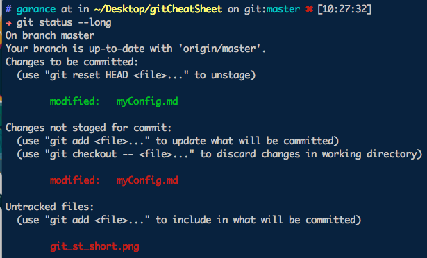

# My git config
My global git config (`~/.gitconfig`)is in this repo as `global-gitconfig`. It has different parts:
## Aliases
Convenience aliases, for the operations I do 50 times a day:  
`git st = git status`  
`git ch = git checkout`  
`git pl = git pull`  
`git ph = git push`  
`git a = git add`  
`git co = git commit -m`  

New commands, for specific operations:  
```shell
git amend = git commit --amend --no-edit
```
Creates a new `amend` command for that specific use case.
```shell
git conflict = !git ls-files -u | cut -f 2 | sort -u
```
Gives me the diff list with _only_ the conflicted files (if any).
```shell
git graph = git log --graph --oneline
```
Shows the commit history, with branches.  

:information_source: The `!` signals it's a script and not a command to concatenate to a git call. Here it's needed to pipe results without having `git` added before the other commands.  

## Log
To print my git logs with a default level of reading comfort, the `abrevCommit` flag is true by default.

## Merge
I never change the merge commit messages. The corresponding flag, `no-edit` is always true.

## Status
The `short` flag is at true, which gives the modified files status with just 1 letter for staged, one letter for unstaged.  
The `branch` flag is at true, to still get branch info even if the output is non verbose.  
For example:  
  
becomes with my config:  
  

# Hooks

## Pre-commit
See the `pre-commit` file, which, in my setup, lives in `~/.git-templates/hooks`.  
This directory is defined in my config, under as a  `templatedir` variable.  
I am aborting commits where modified files contain unwanted elements, such as TO-DOs.  
That's a general rule, no matter the git repository.  
If, with a merge, I happen to have TO-DOs that I can't do anything about, it's always possible to force the commit with the `n` option:
```shell
git commit -mn "Merging with TO-DOs, no choice!"
```

## Post-commit
I haven't found a use for post-commit yet.

# More
* [Studying repo History](studyHistory.md)
* [Fixing mistakes](fixMistakes.md)
* [Fixing conflicts](fixConflicts.md)
* [Stashing](stash.md)
* [Housekeeping the repo](housekeeping.md)
* [Meddling with commits](meddling.md)
* [Juggling with several git config](severalConfigurations.md)
* [Back to the Readme](README.md).